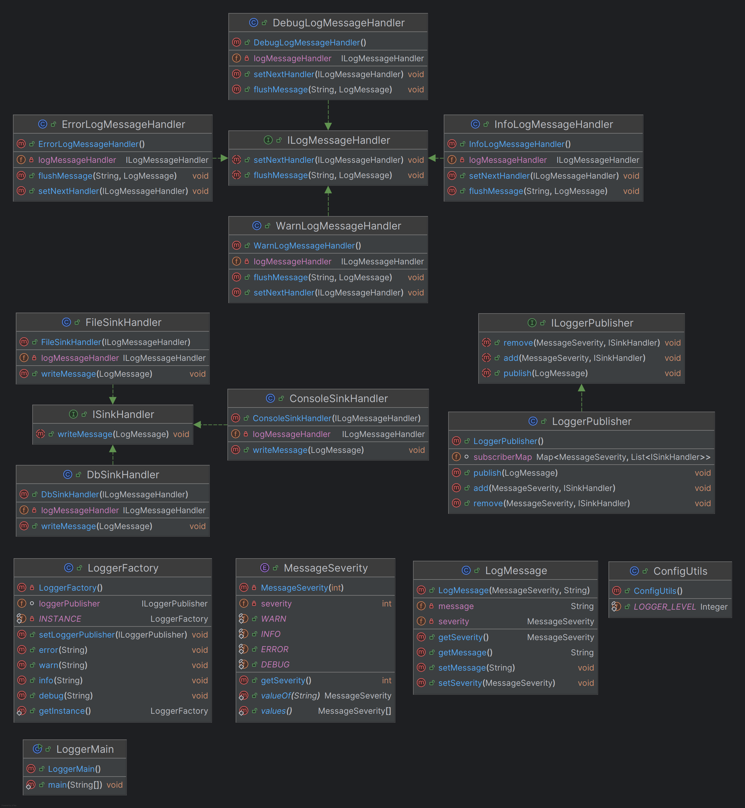

https://thispointer.com/designing-a-configurable-logging-framework-using-observer-design-pattern/
Logging Library Low Level Design
UsesCases:

1) Multiple severity levels of the message e.g. Info,Error, Debug, Warn etc.
2) Logging severity level configured through config properties file. Only the messages whose severity is greater or
   equal to defined severity should be logged.
3) Multiple logging sinks. Each severity level can have its own sink defined,
    1) Error messages to be printed in all sinks(console,db,file).
    2) Info messages to be printed in console.
    3) Debug messages to be printed on file.
    4) Warn messages to be printed on db.

   **Observations**: 1) Since logging library is used at multiple places, it becomes performance overhead if new
   instance
   has to be created every time. Therefore only single instance should be used throughout the application. **_Singleton_
   **
   **_instance_** is good option.
4) The application code should only be responsible to push the log messages. Handling the log messages should be
   decoupled from the application. _**Pub-Sub model of Java which is similar to observer pattern**_ can be used. This
   has
   added advantage that consumer can be made low priority thread which does not impact application performance.
5) Since log level messages follow a **_hierarchy_**, using **_Chain of responsibility pattern is good option_**. Each
   message
   type has its own handler. If the passed message to handler is not of its type then simply redirect it to the next
   handler in line.
6) Choosing the sink is a Strategy which is decided by config properties.

